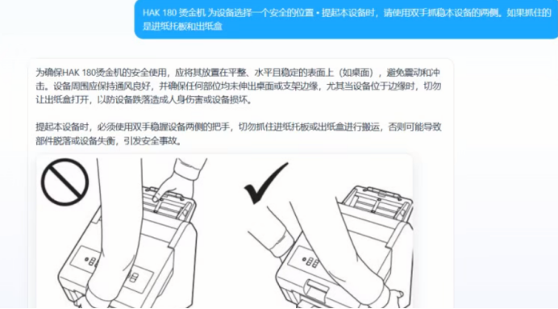

# Multimodal RAG 知识库系统

基于 LangGraph 构建的企业级多模态 RAG（Retrieval-Augmented Generation）知识库系统，支持 多模态 文档的自动化导入、向量化存储，以及多路检索增强生成的智能问答。

## 核心功能

### 知识导入

- **多模态(pdf)文件上传**：通过 Web 界面上传文档，自动解析处理
- **转 Markdown**：集成 MinerU 服务，将 文件 精准转换为 Markdown 格式，后续进行数据清洗
- **图片处理**：自动提取文档中的图片并上传至 MinIO 对象存储
- **文档智能分块**：支持多种分块策略，适配不同模型上下文窗口
- **实体名称识别**：自动从文档中提取核心产品/实体名称
- **BGE-M3 向量化**：使用 BGE-M3 模型生成文本向量表示
- **Milvus 向量入库**：将向量数据持久化存储至 Milvus 向量数据库

### 智能检索

- **多路检索融合**：向量搜索 + HyDE 假设文档搜索 + 知识图谱查询 + Web 搜索四路并行
- **RRF 融合排序**：对多路检索结果进行倒数排列融合
- **BGE-Reranker 重排序**：对候选文档进行精细重排，提升相关性
- **Redis 语义缓存**：基于语义相似度的缓存命中，减少重复 LLM 调用
- **Ragas 评估框架**：集成 ContextPrecision / ContextRecall / ResponseRelevancy / Faithfulness 评估
- **流式 SSE 输出**：支持 Server-Sent Events 流式返回答案

### 测试实例


## 技术架构

```
app/
├── import_process/        # 知识导入服务 (端口 8000)
│   ├── agent/             # LangGraph 导入工作流
│   │   ├── main_graph.py  # 导入流程编排（节点注册 + 边 + 条件路由）
│   │   ├── nodes/         # 各业务节点实现
│   │   │   ├── node_entry.py                # 入口：参数初始化、输入校验
│   │   │   ├── node_pdf_to_md.py            # 解析为 Markdown
│   │   │   ├── node_md_img.py               # 图片提取与上传
│   │   │   ├── node_document_split.py       # 文档分块
│   │   │   ├── node_item_name_recognition.py # 实体名称识别
│   │   │   ├── node_bge_embedding.py        # BGE-M3 向量化
│   │   │   └── node_import_milvus.py        # 向量写入 Milvus
│   │   └── state.py        # 导入流程状态定义
│   └── api/                # FastAPI 接口
├── query_process/          # 知识查询服务 (端口 8001)
│   ├── agent/              # LangGraph 查询工作流
│   │   ├── main_graph.py   # 查询流程编排（多路搜索 + RRF + Rerank + 评估）
│   │   ├── nodes/          # 各业务节点实现
│   │   │   ├── node_cache_check.py          # Redis 语义缓存检查
│   │   │   ├── node_item_name_confirm.py     # 商品/实体名称确认
│   │   │   ├── node_search_embedding.py      # 密集向量检索
│   │   │   ├── node_search_embedding_hyde.py # HyDE 假设文档检索
│   │   │   ├── node_query_kg.py              # 知识图谱查询
│   │   │   ├── node_web_search_mcp.py        # Web 搜索 (MCP)
│   │   │   ├── node_rrf.py                   # RRF 融合排序
│   │   │   ├── node_rerank.py                # BGE-Reranker 重排
│   │   │   ├── node_eval_retrieval.py        # 检索质量评估
│   │   │   ├── node_eval_generation.py       # 生成质量评估
│   │   │   └── node_answer_output.py         # 答案生成与输出
│   │   └── state.py         # 查询流程状态定义
│   └── api/                 # FastAPI 接口
├── clients/                 # 外部服务客户端
│   ├── milvus_utils.py      # Milvus 向量数据库
│   ├── minio_utils.py       # MinIO 对象存储
│   ├── mongo_history_utils.py # MongoDB 对话历史
│   ├── redis_utils.py       # Redis 缓存
│   └── neo4j_utils.py       # Neo4j 知识图谱
├── conf/                    # 配置管理
│   ├── embedding_config.py  # BGE-M3 Embedding 配置
│   ├── reranker_config.py   # BGE-Reranker 配置
│   ├── lm_config.py         # LLM 模型配置
│   ├── milvus_config.py     # Milvus 配置
│   ├── minio_config.py      # MinIO 配置
│   ├── redis_config.py      # Redis 配置
│   ├── mineru_config.py     # MinerU PDF 解析配置
│   └── bailian_mcp_config.py # 百炼 MCP Web 搜索配置
├── compression/             # 上下文压缩
├── eval/                    # Ragas 评估 + 中断机制
├── lm/                      # LLM / Embedding / Reranker 工具
├── tool/                    # 模型下载工具
└── utils/                   # 通用工具函数
```

## 依赖服务

本项目依赖以下外部服务，运行前请确保相关服务已就绪：
- 除了.env文件中需要配置api-key的，其他的你要进行docker部署，部署的注意事项我在.env文件中也说明了

| 服务         | 用途                        | 默认端口 |
| ------------ | --------------------------- | -------- |
| **Milvus**   | 向量数据库，存储文档向量    | 19530    |
| **MinIO**    | 对象存储，存放文档图片      | 9000     |
| **Redis**    | 语义缓存，存储会话摘要      | 6379     |
| **MongoDB**  | 文档数据库，存储对话历史    | 27017    |
| **Neo4j**    | 图数据库，知识图谱查询      | 7687     |
| **MinerU**   | PDF 解析服务                | —        |
| **LLM API**  | OpenAI 兼容 API，大模型推理 | —        |
| **百炼 MCP** | 阿里百炼 Web 搜索服务       | —        |

## 本地模型

项目使用以下开源模型，运行前需下载至本地或 GPU 服务器：

- **BGE-M3**：文本 Embedding 模型，用于文档向量化
- **BGE-Reranker-v2-m3**：交叉编码器重排序模型，用于精细排序
- **VL Model**：多模态视觉语言模型（可选，用于图片理解）

可通过 `app/tool/download_bgem3.py` 和 `app/tool/download_reranker.py` 下载对应模型。

## 环境配置

1. 在项目根目录创建 `.env` 文件，参考以下配置项（这些服务你要后台启动）：

```bash
# ==================== LLM 配置 ====================
OPENAI_BASE_URL=https://your-llm-api.com/v1
OPENAI_API_KEY=your-api-key
LLM_DEFAULT_MODEL=qwen-plus
LLM_DEFAULT_TEMPERATURE=0.01
VL_MODEL=qwen-vl-plus

# ==================== BGE-M3 Embedding 配置 ====================
BGE_M3_PATH=/path/to/bge-m3
BGE_M3=BAAI/bge-m3
BGE_DEVICE=cuda:0
BGE_FP16=1

# ==================== BGE-Reranker 配置 ====================
BGE_RERANKER_LARGE=/path/to/bge-reranker-v2-m3
BGE_RERANKER_DEVICE=cuda:0
BGE_RERANKER_FP16=1

# ==================== Milvus 配置 ====================
MILVUS_URL=http://localhost:19530
CHUNKS_COLLECTION=chunks
ENTITY_NAME_COLLECTION=entity_names
ITEM_NAME_COLLECTION=item_names

# ==================== MinIO 配置 ====================
MINIO_ENDPOINT=localhost:9000
MINIO_ACCESS_KEY=your-access-key
MINIO_SECRET_KEY=your-secret-key
MINIO_BUCKET_NAME=knowledge-base
MINIO_IMG_DIR=images
MINIO_SECURE=False

# ==================== Redis 配置 ====================
REDIS_HOST=localhost
REDIS_PORT=6379
REDIS_PASSWORD=
REDIS_DB=0
REDIS_CACHE_TTL=86400
CACHE_RELEVANCE_THRESHOLD=0.85

# ==================== MongoDB 配置 ====================
MONGO_URI=mongodb://localhost:27017
MONGO_DB=knowledge_base

# ==================== MinerU PDF 解析配置 ====================
MINERU_BASE_URL=https://your-mineru-api.com
MINERU_API_TOKEN=your-mineru-token

# ==================== 百炼 MCP 配置 ====================
MCP_DASHSCOPE_BASE_URL=https://dashscope.aliyuncs.com/compatible-mode/v1
```

## 运行指令

### 安装依赖

```bash
# 安装 Python 依赖（需要 Python 3.10+）
pip install fastapi uvicorn langgraph langchain pymilvus minio redis pymongo neo4j python-dotenv ragas dashscope
pip install transformers torch  # BGE 模型推理
pip install pymupdf pdfplumber  # PDF 处理相关
```

### 启动知识导入服务（端口 8000）

```bash
cd app/import_process/api
python file_import_service.py
```

启动后访问 `http://127.0.0.1:8000/import.html` 打开文件上传页面，支持上传 PDF / MD 文件进行导入。

### 启动知识查询服务（端口 8001）

```bash
cd app/query_process/api
python query_service.py
```

启动后访问 `http://127.0.0.1:8001/chat.html` 打开对话页面，输入问题进行智能问答。

### 下载模型（首次运行前执行）

```bash
# 下载 BGE-M3 Embedding 模型
python app/tool/download_bgem3.py

# 下载 BGE-Reranker 重排序模型
python app/tool/download_reranker.py
```

### API 接口

**知识导入服务** (`http://127.0.0.1:8000`):

- `GET /import.html` — 文件上传 Web 页面
- `POST /upload` — 上传 文件触发导入流程
- `GET /tasks` — 查看任务列表与状态
- `GET /docs` — Swagger API 文档

**知识查询服务** (`http://127.0.0.1:8001`):

- `GET /chat.html` — 对话 Web 页面
- `POST /query` — 提交问题查询（支持流式 SSE）


## 工作流程

### 导入流程

```
文件上传 → 入口校验 → [转MD] → 图片处理 → 文档分块
→ 实体名称识别 → BGE-M3向量化 → 导入Milvus → 完成
```

### 查询流程

```
用户提问 → Redis缓存检查 → 实体名称确认 → 多路并行搜索
    ├─ 向量搜索 (Dense Retrieval)
    ├─ HyDE 搜索 (假设文档向量)
    └─ Web 搜索 (MCP)
→ RRF 融合排序 → BGE-Reranker 重排 → Ragas 检索评估
→ LLM 答案生成 → Eva 生成评估 → 流式输出答案
```
